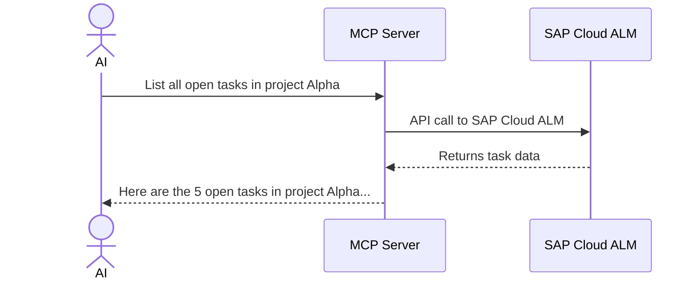
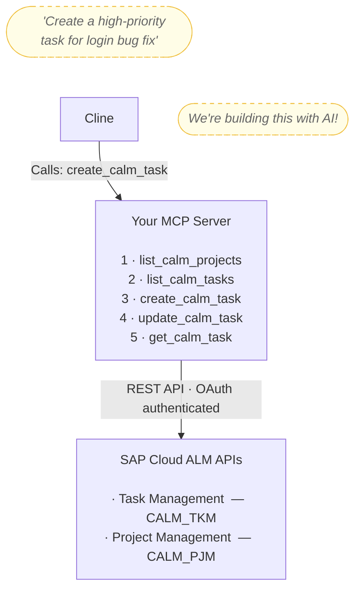
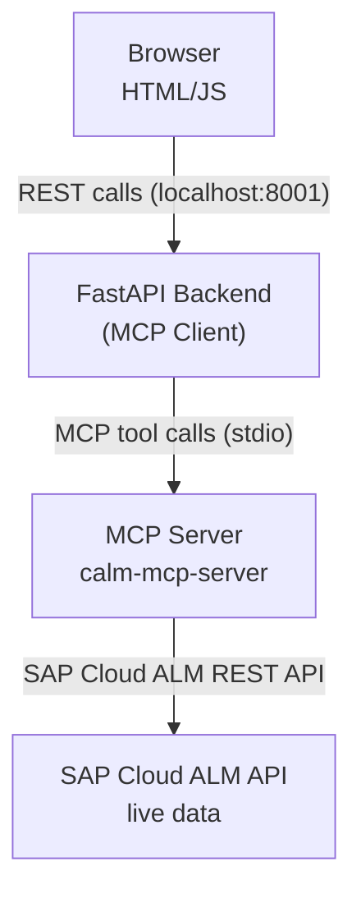

# sap-calmsummit-2026-aiworkshop
SAP Cloud ALM Summit 2026 - AI Extensibility Workshop


# Workshop: Build Your SAP Cloud ALM MCP Server with AI (Vibe Coding)

**Skill Level**: Beginner-friendly (AI does the coding!)  
**What You'll Build**: A working MCP server that exposes SAP Cloud ALM APIs and a small project  
**How**: Using AI tools (Cline/Cursor/Claude) to generate all the code through given prompts  
**Language**: Python (recommended for cross-platform compatibility)
**AI Used**: Cline

---

## 🎯 Workshop Philosophy: "Vibe Coding"

**Traditional Coding Workshop**: Copy-paste code snippets → Debug → Repeat  
**This Workshop**: Give AI prompts → Review generated code → Iterate


By the end of this workshop, you will:

✅ Master vibe coding workflow for API integrations  
✅ Build a complete MCP server using only AI prompts  
✅ Integrate 5 SAP Cloud ALM tools (project listing + task management)  
✅ Test your server by creating your first CALM project and tasks  
✅ Build a web application for structured project creation  
✅ Generate comprehensive documentation automatically  
✅ Know how to extend and maintain AI-generated code


---

## Table of Contents

1. [Prerequisites](#prerequisites)
2. [What Is an MCP Server?](#what-is-an-mcp-server)
3. [Phase 1: Setup & Authentication](#phase-1-setup--authentication)
4. [Phase 2: Build Your First Tool](#phase-2-build-your-first-tool---list-projects)
5. [Phase 3: Register Your MCP Server](#phase-3-register-your-mcp-server)
6. [Recap: What You Built](#recap-what-you-built)
7. [Workshop Feedback](#workshop-feedback)
8. **BONUS** *(optional)*
   - [Phase 4: Add More Tools](#phase-4-add-more-tools)
   - [Generate Your Documentation](#generate-your-documentation)
   - [Workshop Reference](#workshop-reference)
   - [Troubleshooting with AI](#troubleshooting-with-ai)
   - [Part 5: Build a Real Application - CALM Task Manager](#part-5-build-a-real-application---calm-task-manager)
   - [Appendix: Full Project Structure](#appendix-full-project-structure)

---

## Prerequisites

### What You Need

1. **SAP Cloud ALM Access** ✅ **PROVIDED BY INSTRUCTORS**
   - SAP Cloud ALM tenant with API access
   - OAuth credentials (Token URL, Client ID, Client Secret)
   - Access to Task Management API (CALM_TKM) and Project Management API (CALM_PJM)


2. **AI Development Tool** ✅ **Cline Extension for VS Code**
   - **Visual Studio Code** with **Cline extension** installed
   - **SAP AI Core Key** (temporary workshop key provided by instructors)
   - **GitHub account** (free) — required to sign in to VS Code
   
   > **🔑 Workshop Setup**:
   > - Create a free GitHub account (if you don't have one): [github.com/signup](https://github.com/signup)
   > - Install VS Code: [code.visualstudio.com](https://code.visualstudio.com) — sign in with your GitHub account when prompted
   > - Install Cline extension from VS Code marketplace
   > - You'll receive a temporary SAP AI Core key for the workshop — the instructor will show you how to access it
  
3. **Python 3.10+** ✅ **INSTALL BEFORE THE WORKSHOP**

   > **Do this before the workshop day**

   **macOS**:
   - Go to [python.org/downloads/macos](https://www.python.org/downloads/macos/)
   - Download the latest release (Python 3.13.4 - June 10, 2026) and run the macOS installer
   - Follow the installer steps (defaults are fine)
   - Open Terminal and verify: `python3 --version`

   **Windows**:
   - Go to [python.org/downloads/windows](https://www.python.org/downloads/windows/)
   - Download the **Windows installer (64-bit)** for the latest release and run it
   - ⚠️ On the **first screen**: check **"Add Python to PATH"** — easy to miss, critical to check
   - Follow the installer steps
   - Open PowerShell and verify: `python --version`

   > If you see a version number (e.g. `Python 3.13.4`) you're good to go. If you see `"Python was not found"` or the Windows Store opens, the PATH checkbox was missed — reinstall and check it.

4. **Your Computer**
   - [ ] **Any operating system** (Windows, macOS, Linux)
   - [ ] **Internet connection** (for AI tool and SAP Cloud ALM APIs)

5. **Knowledge Requirements**
   - **NONE!** You'll literally copy-paste prompts into Cline
   - AI will write 100% of the code
   - No Python knowledge needed
   - No API knowledge needed

> **🎯 Workshop Philosophy**: You provide clear instructions, AI writes all the code.

> **⚠️ Important**: Workshop credentials (SAP Cloud ALM and SAP AI Core) are temporary and will be deactivated after the workshop ends.

---

## What Is an MCP Server?

### Simple Explanation

An **MCP (Model Context Protocol) server** is a tool that lets AI models interact with external APIs. Think of it as a translator:



### What We're Building



**What you'll learn:**
- Building MCP tools that wrap REST APIs
- Handling task statuses, priorities, and project management
- Testing AI integration with real SAP data

---

## Phase 1: Setup & Authentication

### 🔑 Configure Cline with SAP AI Core

Before running any prompts, you need to enter your SAP AI Core credentials in Cline so it can generate code for you.

1. If not already installed, search for **Cline** in the VS Code Extensions Marketplace and click **Install**

   

2. Click the **Cline** icon in the Activity Bar, then click the **Settings** (gear ⚙) icon in the top-right corner of the Cline panel

   

3. Under **API Provider**, select **SAP AI Core** and enter the credentials provided by the instructors:
   - **AI Core Client Id**: `<provided by instructors>`
   - **AI Core Client Secret**: `<provided by instructors>`
   - **AI Core Base URL**: `<provided by instructors>`
   - **AI Core Auth URL**: `<provided by instructors>`
   - Check **Orchestration Mode**

   

4. Scroll down, select your **Model** (e.g. `anthropic--claude-4.5-sonnet`), and click **Done**

   

✅ **Checkpoint**: Cline shows the model name in the bottom bar and is ready to accept prompts

---

### 📋 Prompt 1.1: Create Project Structure

**Goal**: Create project and authenticate with SAP Cloud ALM! 

**Copy-paste this into your AI tool**:

```
Create a PERMANENT cross-platform MCP (Model Context Protocol) server for SAP Cloud ALM APIs at ~/.mcp/servers/calm-mcp-server/

**Cross-Platform Requirements:**
- Detect OS automatically and use correct paths:
  - Windows: %USERPROFILE%\.mcp\servers\calm-mcp-server\, venv\Scripts\
  - macOS/Linux: ~/.mcp/servers/calm-mcp-server/, venv/bin/
- Check Python 3.10+ availability (try python3.12, python3.11, python3.10, python)
  - If not found: stop and instruct user to install from python.org
- Create virtual environment with the detected Python version
- Install dependencies in requirements.txt:
  - mcp>=1.0.0
  - python-dotenv>=1.0.0
  - httpx>=0.27.0
  - typing-extensions>=4.9.0

**Project Structure:**
calm-mcp-server/
├── src/
│   ├── __init__.py
│   ├── server.py (MCP server - empty skeleton)
│   ├── auth.py (OAuth authentication - empty skeleton)
│   └── calm_client.py (SAP Cloud ALM API client - empty skeleton)
├── venv/
├── .env (template below)
├── .gitignore (exclude venv/, .env, __pycache__/, *.pyc, .DS_Store)
└── requirements.txt

**.env template:**
# SAP Cloud ALM API Configuration
CALM_BASE_URL=https://your-tenant.eu10.alm.cloud.sap
CALM_OAUTH_URL=https://your-tenant.authentication.eu10.hana.ondemand.com/oauth/token
CALM_CLIENT_ID=your-client-id-here
CALM_CLIENT_SECRET=your-client-secret-here

**Important:**
- DO NOT create README.md yet - we'll generate documentation at the end
- Show final summary with: Python version, OS detected, installation status, full absolute path
- After creation, ask the user if they want to open the workspace in VS Code
```

**What AI will create**:
- Detect your home directory automatically
- Check Python 3.10+ is available
- Ask if you want to open the workspace after creation
- Create two-level structure:
- Create PERMANENT MCP server at: ~/.mcp/servers/calm-mcp-server/
- Set up virtual environment
- Install all dependencies
- Create Python files with documentation
- Set up .env template and .gitignore

✅ **Checkpoint**: AI shows you the directory tree at ~/.mcp/servers/calm-mcp-server/ with `src/` folder, `requirements.txt`, `.env`, `.gitignore` (no README yet)

---

### 📋 Prompt 1.2: Configure Your Credentials

**Manual step** (not an AI prompt):

1. Open the `.env` file that AI created
2. The instructor will share a link where you can retrieve your **SAP Cloud ALM credentials**

3. Your `.env` file should look like this:

```bash
CALM_BASE_URL=https://your-actual-tenant.eu10.alm.cloud.sap
CALM_OAUTH_URL=https://your-tenant.authentication.eu10.hana.ondemand.com/oauth/token
CALM_CLIENT_ID=abc123xyz...
CALM_CLIENT_SECRET=secret456...
```

✅ **Checkpoint**: Your `.env` file has real credentials (not placeholders)

---

### 📋 Prompt 1.3: Build OAuth Authentication

**Copy-paste this into your AI tool**:

```
In src/auth.py, implement OAuth 2.0 client credentials flow for SAP Cloud ALM.

**Requirements:**
- Create an async function: get_access_token() that returns a valid access token string
- Load credentials from environment variables using python-dotenv:
  - CALM_OAUTH_URL
  - CALM_CLIENT_ID  
  - CALM_CLIENT_SECRET
- Use httpx.AsyncClient to make the OAuth token request
- Implement token caching: store the token in a module-level variable with expiration time
- Only fetch a new token when the cached one expires (check expires_in from response)
- Handle errors gracefully with try/except and clear error messages
- Add helpful comments explaining the OAuth flow
- Export the function
```

**What AI will create**:
- Complete `src/auth.py` with OAuth implementation and token caching

✅ **Checkpoint**: AI shows you the completed auth.py file

---

### 📋 Prompt 1.4: Create CLAUDE.md

**Copy-paste this into your AI tool**:

```
Create a CLAUDE.md file at the root of ~/.mcp/servers/calm-mcp-server/

This file will give your AI assistant automatic context about this project in every future conversation.

Include the following sections:

## Project Overview
- This is an MCP (Model Context Protocol) server that exposes SAP Cloud ALM APIs as tools for AI assistants
- Language: Python 3.10+, async/await throughout
- MCP SDK: mcp>=1.0.0, using Server, stdio_server, Tool, TextContent
- HTTP client: httpx.AsyncClient with timeout=30.0

## File Structure
- src/auth.py — OAuth 2.0 client credentials flow, get_access_token() with token caching
- src/calm_client.py — CALMClient class wrapping SAP Cloud ALM REST APIs
- src/server.py — MCP server, tool definitions and handlers
- .env — credentials (never commit this file)

## SAP Cloud ALM APIs
Base URL loaded from CALM_BASE_URL environment variable.

Project Management API (/calm-projects/v1):
- GET /calm-projects/v1/projects — list projects (params: $top, $filter)
- Project status codes: O=Active, C=Hidden

Task Management API (/calm-tasks/v1):
- POST /calm-tasks/v1/tasks — create task (required: projectId, title)
- GET /calm-tasks/v1/tasks — list tasks (params: projectId, status, assigneeId) — NOTE: $top is NOT supported by this endpoint
- PATCH /calm-tasks/v1/tasks/{id} — update task
- GET /calm-tasks/v1/tasks/{id} — get task
- Task status codes: CIPTKOPEN=Open, CIPTKINP=In Progress, CIPTKBLK=Blocked, CIPTKCLOSE=Done
- Priority codes (priorityId integer): 10=Very High, 20=High, 30=Medium, 40=Low

## Coding Conventions
- All CALMClient methods are async, use httpx.AsyncClient
- Authentication: always call get_access_token() from src.auth, pass as Bearer token
- Error handling: catch httpx.HTTPStatusError and httpx.RequestError, raise Exception with clear messages
- MCP tools return list[TextContent]
- No frameworks — keep dependencies minimal
```

**What AI will create**:
- `CLAUDE.md` at `~/.mcp/servers/calm-mcp-server/CLAUDE.md`
- From this point on, your AI assistant will have full project context in every new conversation

✅ **Checkpoint**: `CLAUDE.md` exists at the project root

---

## Phase 2: Build Your First Tool - List Projects

**Goal**: Create MCP server with "list projects" tool

### 📋 SAP Cloud ALM API Schema Reference

**Use this if AI asks for field names or valid values during implementation:**

<details>
<summary><strong>Click to expand:</strong></summary>

**Task Object Fields:**
```
id              string (UUID, read-only)
projectId       string (UUID, required for creation)
title           string (max 180 chars, required)
description     string (optional)
status          string (status codes - see below)
priorityId      integer (10=Very High, 20=High, 30=Medium, 40=Low)
assigneeId      string (user UUID, optional)
startDate       string (ISO date: "2022-07-01", optional)
dueDate         string (ISO date: "2022-07-31", optional)
displayId       string (read-only, e.g., "TASK-123")
```

**Task Status Codes (by task type):**
- For regular tasks (CALMTASK, CALMTMPL, CALMST):
  - `CIPTKOPEN` - Open
  - `CIPTKINP` - In Progress
  - `CIPTKBLK` - Blocked
  - `CIPTKCLOSE` - Done
  - `CIPTKNO` - Not Relevant

**Query Parameters for GET /calm-tasks/v1/tasks:**
```
projectId       string (UUID, filter by project)
status          string (filter by status code, e.g., "CIPTKOPEN")
assigneeId      string (filter by assignee user ID)
```
Note: `$top` is NOT supported by the tasks endpoint — do not pass it.

**Create Task (POST /calm-tasks/v1/tasks):**
```json
{
  "projectId": "uuid-here",
  "title": "Fix login bug",
  "description": "Optional description",
  "priorityId": 20,
  "assigneeId": "user-uuid-optional",
  "status": "CIPTKOPEN"
}
```

**Update Task (PATCH /calm-tasks/v1/tasks/{id}):**
- Partial updates allowed - send only fields to change
- Updatable fields: title, description, status, priorityId, assigneeId, dueDate

**Project Object Fields:**
```
id                  string (UUID, read-only)
name                string (max 128 chars)
status              string (O=Active, C=Hidden)
operationalStatus   string (ONTRK=On Track, NATTN=Needs Attention, CRIT=Critical)
purpose             string (IMPLEMENTATION, SERVICE_DELIVERY)
```

**Query Parameters for GET /calm-projects/v1/projects:**
```
$top            integer (limit results)
$filter         string (OData filter expression, optional)
```

</details>

---

### 📋 Prompt 2.1: Build SAP Cloud ALM API Client

**Copy-paste this into your AI tool**:

```
In src/calm_client.py, create a CALMClient class that wraps SAP Cloud ALM Project Management API.

**Project Management API — field reference:**
- Endpoint: GET /calm-projects/v1/projects
- Query parameters: $top (integer, limit results), $filter (OData filter string, optional)
- Response fields per project: id (UUID), name (string), status ("O"=Active, "C"=Hidden),
  operationalStatus ("ONTRK"=On Track, "NATTN"=Needs Attention, "CRIT"=Critical),
  purpose ("IMPLEMENTATION", "SERVICE_DELIVERY")

Requirements:
- Class should load CALM_BASE_URL from environment variables
- Make it work with async/await throughout
- Implement this async method:

  1. list_projects(self, filters=None)
     - HTTP GET to /calm-projects/v1/projects
     - Accept optional filters dict with: name, limit
     - Map limit to $top query parameter

The method must:
- Import and call get_access_token() from src.auth to get the bearer token
- Use httpx.AsyncClient for requests with timeout=30.0
- Include these headers:
  - Authorization: Bearer {token}
  - Content-Type: application/json
- Parse and return the JSON response. **Important**: Handle both response formats — if the response is already a list, return it directly; otherwise extract with `response.get("value", [])`. Do NOT assume OData format.
- **Important**: after any code change, delete the `__pycache__` folder inside `src/` and restart the MCP server in Cline (click ↺ next to the server name) so the updated code is loaded.
- Handle HTTP errors with try/except blocks:
  - Catch httpx.HTTPStatusError for HTTP errors (4xx, 5xx)
  - Catch httpx.RequestError for network errors
  - Include response body in error messages when available
  - Raise Exception with clear error messages

Make the code clean and easy to extend with more methods later.

Export the CALMClient class.

If you have any doubts about field names, valid values, or API behavior, ask me before writing the code.
```

**What AI will create**:
- CALMClient class in src/calm_client.py with the `list_projects` method

✅ **Checkpoint**: AI shows you `calm_client.py` with `list_projects` implemented
- Error handling and proper headers
- NOTE: More methods will be added in Phase 4 alongside their tools

> 🔄 **Reload required**: After every change to the MCP server code, press `Cmd+Shift+P` (macOS) or `Ctrl+Shift+P` (Windows/Linux), type **Reload Window**, and press Enter. Cline only picks up the updated code after a window reload.


---

### 📋 Prompt 2.2: Build MCP Server with First Tool

**Copy-paste this into your AI tool**:

```
In src/server.py, create an MCP server using the official Python MCP SDK.

Requirements:

1. Import necessary components:
   - from mcp.server import Server
   - from mcp.server.stdio import stdio_server
   - from mcp.types import Tool, TextContent
   - from .calm_client import CALMClient

2. Create a Server instance with name "calm-mcp-server"

3. Register ONE tool using @server.list_tools() decorator that returns a list:
   
   Tool: "list_calm_projects"
   - Description: "List all projects in SAP Cloud ALM"
   - Parameters:
     - name (optional): string, filter by project name
     - limit (optional): integer, default 20, max results

4. Implement tool invocation handler using @server.call_tool() decorator:
   - Takes parameters: name (str) and arguments (dict)
   - Create async handler function:
     - handle_list_projects(client, arguments)
   - Handler creates CALMClient, calls list_projects() method, formats results
   - Return list[TextContent] with the project list (id, name, status for each)
   
   NOTE: We'll add more tools in Phase 4

5. Add async main() function that:
   - Uses stdio_server() context manager
   - Runs the server with read/write streams
   - Uses server.create_initialization_options()

6. Add if __name__ == "__main__" block that runs asyncio.run(main())

7. Include comprehensive error handling and helpful comments explaining the MCP protocol flow

Make the code clean and easy to extend with more tools later.

If you have any doubts about field names, valid values, or API behavior, ask me before writing the code.
```

**What AI will create**:
- Complete MCP server implementation
- One tool definition: list_calm_projects
- Async tool handler
- Integration with CALMClient
- Proper main block


✅ **Checkpoint**: AI shows you the completed `server.py` file

> 🔄 **Reload required**: After every change to the MCP server code, press `Cmd+Shift+P` (macOS) or `Ctrl+Shift+P` (Windows/Linux), type **Reload Window**, and press Enter. Cline only picks up the updated code after a window reload.

---

## Phase 3: Register Your MCP Server

**Goal**: Connect your MCP server to Cline and test your first tool

<a id="prompt-31-register-mcp-server-with-claude-code"></a>

### 📋 Prompt 3.1: Register MCP Server with Cline

**Copy-paste this into your AI tool**:

```
Set up my Python MCP server "calm-mcp-server" with Cline for GLOBAL access (available in all projects).

CRITICAL Requirements for Production Setup:

Register by editing the Cline MCP settings file directly:
- macOS/Linux: ~/Library/Application Support/Code/User/globalStorage/saoudrizwan.claude-dev/settings/cline_mcp_settings.json
- Windows: %APPDATA%\Code\User\globalStorage\saoudrizwan.claude-dev\settings\cline_mcp_settings.json

Use INLINE credentials (not .env file) for production reliability
The server must work from any working directory
No dependency on external .env file location
Use ABSOLUTE paths for everything

My MCP server details:

Location: ~/.mcp/servers/calm-mcp-server
Detect the full absolute path automatically
Python executable:
macOS/Linux: [full-path]/.mcp/servers/calm-mcp-server/venv/bin/python
Windows: [full-path]\.mcp\servers\calm-mcp-server\venv\Scripts\python.exe
My SAP Cloud ALM credentials are already in ~/.mcp/servers/calm-mcp-server/.env — read them from there:

CALM_BASE_URL
CALM_OAUTH_URL
CALM_CLIENT_ID
CALM_CLIENT_SECRET

DO NOT show me the config — add it yourself:

1. Detect my operating system (Windows/macOS/Linux)
2. Detect the full absolute path to ~/.mcp/servers/calm-mcp-server
3. Read my SAP Cloud ALM credentials from ~/.mcp/servers/calm-mcp-server/.env
4. Open the Cline MCP settings file:
   - macOS/Linux: ~/Library/Application Support/Code/User/globalStorage/saoudrizwan.claude-dev/settings/cline_mcp_settings.json
   - Windows: %APPDATA%\Code\User\globalStorage\saoudrizwan.claude-dev\settings\cline_mcp_settings.json
5. Add (or merge) the following entry into the "mcpServers" object:
   {
     "calm-mcp-server": {
       "command": "[absolute-path-to-python]",
       "args": ["-m", "src.server"],
       "env": {
         "CALM_BASE_URL": "[your value]",
         "CALM_OAUTH_URL": "[your value]",
         "CALM_CLIENT_ID": "[your value]",
         "CALM_CLIENT_SECRET": "[your value]",
         "PYTHONPATH": "[absolute-path-to-calm-mcp-server]"
       }
     }
   }
   PYTHONPATH ensures Python finds the src module from any working directory

CRITICAL:
Use correct paths for the detected operating system:
macOS/Linux: ~/.mcp/servers/calm-mcp-server/venv/bin/python
Windows: $env:USERPROFILE\.mcp\servers\calm-mcp-server\venv\Scripts\python.exe

After editing the file:
1. Restart VS Code completely
2. Open Cline and verify the server appears in the MCP Servers list (✔ Connected)

This will make calm-mcp-server available GLOBALLY in all my projects FOREVER.
```

**What AI will do**:
- Read your credentials from `.env`, then directly edit the Cline MCP settings file
- Add the server configuration with inline credentials and PYTHONPATH
- Verify the file was updated correctly

**What happens**:

1. **AI asks for your SAP Cloud ALM credentials**:
   - It will read the credentials inside the `.env` file 

2. **AI edits the Cline config file** (example of the entry it adds):

   **macOS/Linux** — `~/Library/Application Support/Code/User/globalStorage/saoudrizwan.claude-dev/settings/cline_mcp_settings.json`:
   ```json
   {
     "mcpServers": {
       "calm-mcp-server": {
         "command": "/Users/yourname/.mcp/servers/calm-mcp-server/venv/bin/python",
         "args": ["-m", "src.server"],
         "env": {
           "CALM_BASE_URL": "https://your-tenant.eu10.alm.cloud.sap",
           "CALM_OAUTH_URL": "https://your-tenant.authentication.eu10.hana.ondemand.com/oauth/token",
           "CALM_CLIENT_ID": "sb-...",
           "CALM_CLIENT_SECRET": "...",
           "PYTHONPATH": "/Users/yourname/.mcp/servers/calm-mcp-server"
         }
       }
     }
   }
   ```

   **Windows** — `%APPDATA%\Code\User\globalStorage\saoudrizwan.claude-dev\settings\cline_mcp_settings.json`:
   ```json
   {
     "mcpServers": {
       "calm-mcp-server": {
         "command": "C:\\Users\\yourname\\.mcp\\servers\\calm-mcp-server\\venv\\Scripts\\python.exe",
         "args": ["-m", "src.server"],
         "env": {
           "CALM_BASE_URL": "https://your-tenant.eu10.alm.cloud.sap",
           "CALM_OAUTH_URL": "https://your-tenant.authentication.eu10.hana.ondemand.com/oauth/token",
           "CALM_CLIENT_ID": "sb-...",
           "CALM_CLIENT_SECRET": "...",
           "PYTHONPATH": "C:\\Users\\yourname\\.mcp\\servers\\calm-mcp-server"
         }
       }
     }
   }
   ```

   > 📝 **What this does**: Registers the server in Cline's global MCP config with inline credentials and PYTHONPATH so Python finds the `src` module from any working directory.

3. **Restart VS Code completely** to load the MCP server:
   - Exit and restart VS Code
   - The MCP server is now available in ALL your projects

   > 🔄 **Reload required**: You must reload (or restart) VS Code every time you change the MCP server configuration or code. Press `Cmd+Shift+P` (macOS) or `Ctrl+Shift+P` (Windows/Linux), type **Reload Window**, and press Enter as a faster alternative to a full restart.

4. **Verify in Cline**:
   - Open VS Code → Cline extension → click the **MCP Servers** icon
   - You should see `calm-mcp-server` listed as ✔ Connected

    > 

   > 💡 **Tip**: Check the Cline MCP settings file to verify the full configuration with your credentials


✅ **Checkpoint**: MCP server registered globally in Cline with inline credentials, works from any directory

---

### 🧪 Test Your First Tool 

Verify that `list_calm_projects` works end-to-end:

Try opening a new Cline chat and ask what tools are available, then:

```
Show me the first 5 projects in SAP Cloud ALM
```

Expected: Cline calls `list_calm_projects` and returns the list of projects with their IDs and names.

> 💡 **Save a project ID!** You'll need it when testing task tools in Phase 4.

**If it works** → great! You can either:
- **Continue to [Phase 4](#phase-4-add-more-tools)** to add more tools to your MCP server, OR
- **Jump to [Part 5: Build a Web App](#part-5-build-a-real-application---calm-task-manager)** to test your first tool in a real UI right now

**If it doesn't** → use the [Troubleshooting](#troubleshooting-with-ai) prompts to fix the issue now, before adding more tools.

> 

---

## Recap: What You Built

### 🏆 Congratulations!

You've completed the **SAP Cloud ALM + MCP Workshop**. Here's everything you built:

✅ **Phase 1**: Project structure, OAuth 2.0 authentication, and CLAUDE.md configuration  
✅ **Phase 2**: SAP Cloud ALM API client and MCP server with your first tool (`list_calm_projects`)  
✅ **Phase 3**: MCP server registered with Cline and working end-to-end

---

### What You Built

**MCP Server** (`~/.mcp/servers/calm-mcp-server/`):
- Connects to SAP Cloud ALM via OAuth 2.0
- Exposes `list_calm_projects` as an AI-callable tool
- Registered and working inside Cline

---

### 🗑️ Clean Up (Optional)

If you do not want to continue with the excerises and you want to remove everything you built, here's where the files live:

**Project Files — the MCP server itself:**
```
~/.mcp/servers/calm-mcp-server/
```
Delete this entire folder to remove the server code, virtual environment, and credentials.

**MCP Settings — where Cline registers your server:**

| Platform | File Location |
|----------|---------------|
| macOS / Linux | `~/Library/Application Support/Code/User/globalStorage/saoudrizwan.claude-dev/settings/cline_mcp_settings.json` |
| Windows | `%APPDATA%\Code\User\globalStorage\saoudrizwan.claude-dev\settings\cline_mcp_settings.json` |

Open that JSON file and remove the `"calm-mcp-server"` entry from the `"mcpServers"` object.

**To clean up completely:**
1. Delete `~/.mcp/servers/calm-mcp-server/`
2. **Remove the `calm-mcp-server` entry from `cline_mcp_settings.json`** (path above for your OS) — removing the project folder does NOT update this file automatically. Either open it manually and delete the entry, or ask Cline: *"Remove the calm-mcp-server entry from my Cline MCP settings file"*.
3. Restart VS Code — Cline will no longer show the server

---

### 📚 What You Learned

**Technical Skills**:
- Model Context Protocol (MCP) architecture
- SAP Cloud ALM API integration
- OAuth 2.0 client credentials flow

**Integration Patterns**:
- AI tool calling (Cline uses your MCP tools)
- Vibe coding — building with natural language prompts

**SAP Ecosystem**:
- Cloud ALM Project Management API
- API Business Hub structure

---

### 📚 Resources

**SAP Cloud ALM**:
- API Hub: [hub.sap.com](https://hub.sap.com)
- Task Management API: [hub.sap.com/api/CALM_TKM](https://hub.sap.com/api/CALM_TKM)
- Project Management API: [hub.sap.com/api/CALM_PJM](https://hub.sap.com/api/CALM_PJM)

**Model Context Protocol**:
- Specification: [modelcontextprotocol.io](https://modelcontextprotocol.io)
- Python SDK: [github.com/modelcontextprotocol/python-sdk](https://github.com/modelcontextprotocol/python-sdk)

**Reference Guides**:
- [CUSTOMER_GUIDE_AI_EXTENSIONS.md](./CUSTOMER_GUIDE_AI_EXTENSIONS.md) - Architectural patterns and best practices

---

## Workshop Feedback

We'd love to hear your experience:

**What worked well**:
- Which prompts were most effective?
- What features did you add?

**What was challenging**:
- Which AI responses needed iteration?
- What documentation would help?

**What surprised you**:
- How much could AI do?
- What did you learn about vibe coding?

---

## BONUS: Go Further

> These sections are **optional** — designed for participants who finish early

---

## Phase 4: Add More Tools

**Goal**: Add 4 more tools to your MCP server (list tasks, create task, update task, get task)

### 📋 Prompt 4.1: Add List Tasks Tool

**Copy-paste this into your AI tool**:

```
Add a second tool to src/server.py called "list_calm_tasks".

**Task Management API — field reference:**
- Endpoint: GET /calm-tasks/v1/tasks
- Query parameters: projectId (required), status, assigneeId, $top
- Response fields per task: id (UUID), title (string), status (string), priorityId (integer),
  assigneeId (UUID), dueDate (ISO date)
- Task status codes: "CIPTKOPEN"=Open, "CIPTKINP"=In Progress, "CIPTKBLK"=Blocked, "CIPTKCLOSE"=Done

Requirements:
- Add a new @server.call_tool() decorator for "list_calm_tasks"
- Description: "List tasks from SAP Cloud ALM for a specific project with optional filters"
- Parameters:
  - project_id: string, required, project UUID/GUID
  - status: string, optional, task status code (e.g., "CIPTKOPEN" for Open)
  - assigned_to: string, optional, user ID
  - limit: integer, optional, default 50, max results

- Also add a new async method to CALMClient in src/calm_client.py:

  list_tasks(self, project_id, filters=None)
  - HTTP GET to /calm-tasks/v1/tasks
  - project_id (str, required): UUID of the project
  - Accept optional filters dict with: status, assignee_id, limit
  - Build query parameters: projectId (required), status, assigneeId, $top
  - Valid status codes: "CIPTKOPEN", "CIPTKINP", "CIPTKBLK", "CIPTKCLOSE"
  - Parse and return the JSON response. **Important**: the tasks API returns a plain JSON array (not OData). Handle both formats: if the response is already a list, return it directly; otherwise extract with `response.get("value", [])`. Do NOT assume OData format.
  - Same authentication and error handling pattern as list_projects
  - Do NOT add a `$top` / limit parameter — the tasks API does not support it

- Implement the async handler function in server.py:
  - Create CALMClient instance
  - Call list_tasks() with the parameters
  - Return list[TextContent] with formatted task results

Keep the existing list_calm_projects tool working. Don't break anything.

If you have any doubts about field names, valid values, or API behavior, ask me before writing the code.
```

**What AI will do**:
- Add `list_tasks()` method to `calm_client.py`
- Add new tool decorator and handler to `server.py`
- Maintain existing list_calm_projects tool

✅ **Checkpoint**: AI shows you the updated files with 2 tools

> 🔄 **Reload required**: After every change to the MCP server code, press `Cmd+Shift+P` (macOS) or `Ctrl+Shift+P` (Windows/Linux), type **Reload Window**, and press Enter. Cline only picks up the updated code after a window reload.

---

### 🧪 Test Your Second Tool 

Verify that `list_tasks` works end-to-end:

Try opening a new Cline chat and ask what tools are available, then:

```
Show me the first 5 tasks in the project with id: "..."
```

Expected: Cline calls `list_tasks` and returns the list of tasks with their IDs, titles and status.

**If it works** → proceed to Phase 4.2 to add more tools.  
**If it doesn't** → use the [Troubleshooting](#troubleshooting-with-ai) prompts to fix the issue now, before adding more tools.

> 


---

### 📋 Prompt 4.2: Add Create Task + Two More Tools

**Copy-paste this into your AI tool**:

```
Add three more tools to src/server.py:

**Task Management API — field reference:**
- Task fields: id (UUID), projectId (UUID), title (string, max 180 chars), description (string),
  status (string, see codes below), priorityId (integer), assigneeId (UUID), dueDate (ISO date)
- Priority codes: 10=Very High, 20=High, 30=Medium, 40=Low
- Task status codes: "CIPTKOPEN"=Open, "CIPTKINP"=In Progress, "CIPTKBLK"=Blocked,
  "CIPTKCLOSE"=Done, "CIPTKNO"=Not Relevant
- POST /calm-tasks/v1/tasks — required: projectId, title; optional: description, priorityId, assigneeId, status
- PATCH /calm-tasks/v1/tasks/{id} — partial updates, same fields
- GET /calm-tasks/v1/tasks/{id}

Tool 1: "create_calm_task"
- Description: "Create a new task in SAP Cloud ALM"
- Parameters:
  - title: string, required, task title
  - description: string, optional, task description
  - project_id: string, required, project GUID
  - priority: string, optional, one of LOW/MEDIUM/HIGH/CRITICAL, defaults to MEDIUM
  - assigned_to: string, optional, user ID to assign the task to
- Handler implementation:
  - Priority mapping (user-friendly → API code): LOW→40, MEDIUM→30, HIGH→20, CRITICAL→10
  - Add mapping to translate the priority parameter to priorityId integer before calling the API
  - Call CALMClient.create_task() with the parameters
  - Return success message with the created task details

Tool 2: "update_calm_task"
- Description: "Update an existing task in SAP Cloud ALM"
- Parameters:
  - task_id: string, required
  - status: string, optional, one of OPEN/IN_PROGRESS/BLOCKED/DONE (user-friendly values)
  - priority: string, optional, one of LOW/MEDIUM/HIGH/CRITICAL
  - assigned_to: string, optional
  - description: string, optional
- Handler implementation:
  - **Important**: Task status codes are LONG codes, not short ones (different from project status)
  - Use this exact status mapping:
    - OPEN → "CIPTKOPEN"
    - IN_PROGRESS → "CIPTKINP"
    - BLOCKED → "CIPTKBLK"
    - DONE → "CIPTKCLOSE"
  - Create a status mapping dictionary in the handler and translate before calling CALMClient.update_task()
- Handler: calls CALMClient.update_task() with mapped status

Tool 3: "get_calm_task"
- Description: "Get detailed information about a specific task"
- Parameters:
  - task_id: string, required
- Handler: calls CALMClient.get_task()

Also add these three new async methods to CALMClient class in src/calm_client.py:

1. create_task(self, task_data)
   - HTTP POST to /calm-tasks/v1/tasks
   - Send task_data as JSON body
   - Required fields: projectId (UUID), title (string)
   - Optional fields: description, priorityId (10/20/30/40), assigneeId, status, dueDate
   - Same authentication and error handling pattern as other methods

2. update_task(self, task_id, updates)
   - HTTP PATCH to /calm-tasks/v1/tasks/{task_id}
   - Send updates as JSON body (partial updates allowed)
   - Updatable fields: title, description, status, priorityId, assigneeId, dueDate

3. get_task(self, task_id)
   - HTTP GET to /calm-tasks/v1/tasks/{task_id}

Add all three tools and the three new CALMClient methods. Keep all existing tools (list_calm_projects, list_calm_tasks) working.

If you have any doubts about field names, valid values, or API behavior, ask me before writing the code.
```

**What AI will do**:
- Add three new tool decorators and handlers to `server.py`
- Add `create_task()`, `update_task()`, and `get_task()` methods to `calm_client.py`
- Maintain all existing functionality

✅ **Checkpoint**: You now have 5 working tools! AI shows you the complete updated files.

> 🔄 **Reload required**: After every change to the MCP server code, press `Cmd+Shift+P` (macOS) or `Ctrl+Shift+P` (Windows/Linux), type **Reload Window**, and press Enter. Cline only picks up the updated code after a window reload.

> 

---

### 🧪 Test Each Tool

**In your AI chat** (Cline / Cursor), type these prompts one by one:

**Test 1: Tool Discovery**
```
What MCP tools do you have available from the calm-mcp-server?
```
Expected: AI lists your 5 tools

**Test 2: List Projects**
```
Show me the first 5 projects in SAP Cloud ALM
```
Expected: AI calls list_calm_projects and shows the available projects
💡 **Save a project ID!** You'll need it for the next tests.

**Test 3: List Tasks**
```
List the first 5 tasks in project [paste-your-project-id]
```
Expected: AI calls list_calm_tasks and shows tasks in that project

**Test 4: Create Task**
```
Create a task titled "Test ..." in project [paste-your-project-id] with high priority
```
Expected: AI calls create_calm_task and shows success message with task ID
💡 **Save this task ID!** You'll need it for the next tests.

**Test 5: Get Task Details**
```
Show me details for task [paste-task-id-from-test-4]
```
Expected: AI calls get_calm_task and shows full task info

**Test 6: Update Task**
```
Change the status of task [paste-task-id] to IN_PROGRESS
```
Expected: AI calls update_calm_task and confirms update

✅ **Checkpoint**: All 6 tests work! Your MCP server is fully functional with 5 tools.

---

## Generate Your Documentation

**Goal**: Create comprehensive README.md for your MCP server

Now that all features are built and working, generate complete documentation that covers everything you've created.

### 📋 Prompt: Generate Complete README

**Copy-paste this into your AI tool**:

```
Generate a comprehensive README.md for the calm-mcp-server at ~/.mcp/servers/calm-mcp-server/

Include these sections:

1. **Title & Overview**
   - What this MCP server does
   - Key features (5 tools)
   - SAP Cloud ALM API integration

2. **Prerequisites**
   - Python 3.10+
   - SAP Cloud ALM credentials
   - Cline or MCP-compatible AI tool

3. **Installation**
   - Step-by-step setup commands
   - Virtual environment creation
   - Dependency installation
   - Environment configuration (.env template)

4. **Configuration**
   - Required environment variables with descriptions
   - How to get SAP Cloud ALM credentials
   - Global MCP server registration with claude mcp add
   - Include both macOS/Linux and Windows examples

5. **Available Tools**
   - Document all 5 tools with:
     * Tool name
     * Description
     * Parameters (required and optional)
     * Example usage from Cline chat
     * Expected output

   Tools to document:
   - list_calm_projects
   - list_calm_tasks
   - create_calm_task  
   - update_calm_task
   - get_calm_task

6. **Usage Examples**
   - Real conversational examples with Cline
   - Show multi-step workflows
   - Common use cases

7. **Project Structure**
   - Directory tree with file descriptions
   - Explain purpose of each module

8. **Troubleshooting**
   - Common issues and fixes
   - Authentication errors
   - Module import errors
   - MCP discovery issues

9. **Development**
   - How to add new tools
   - Testing locally
   - Contributing guidelines

10. **License & Credits**
    - Workshop information
    - SAP Cloud ALM API references

Make it professional, clear, and ready for production use.
```

**What AI will create**:
- Complete README.md with all sections
- Code examples for every tool
- Troubleshooting guide
- Professional documentation

✅ **Checkpoint**: README.md generated at ~/.mcp/servers/calm-mcp-server/README.md

> **Why generate documentation at the end?** Because now it reflects the COMPLETE state of your project, including all 5 tools, any customizations you added, and the exact configuration that works. Generated at the beginning, it would have been incomplete.

---

## Workshop Reference

### SAP Cloud ALM API — Key Field Reference

The prompts in this guide already include the field names, codes, and endpoint specs you need. Use the table below if AI asks for clarification or you need to debug an API error.

**Task status codes** (use exact strings):
| User-friendly | API code |
|---|---|
| Open | `CIPTKOPEN` |
| In Progress | `CIPTKINP` |
| Blocked | `CIPTKBLK` |
| Done | `CIPTKCLOSE` |

**Task priority codes** (use integer values):
| User-friendly | priorityId |
|---|---|
| Very High | `10` |
| High | `20` |
| Medium | `30` |
| Low | `40` |

**Project status codes**: `O` = Active, `C` = Hidden

**Key endpoints**:
- `GET /calm-projects/v1/projects` — list projects (params: `$top`, `$filter`)
- `GET /calm-tasks/v1/tasks` — list tasks (params: `projectId`, `status`, `assigneeId`, `$top`)
- `POST /calm-tasks/v1/tasks` — create task (required: `projectId`, `title`)
- `PATCH /calm-tasks/v1/tasks/{id}` — update task
- `GET /calm-tasks/v1/tasks/{id}` — get task


---


## Troubleshooting with AI

### Common Issues → AI Prompts to Fix Them

#### 🔴 Authentication Fails

Before asking Cline to debug, do these manual checks first:

1. Open `~/.mcp/servers/calm-mcp-server/.env` and verify all four values are filled in (no placeholders):
   ```
   CALM_BASE_URL=https://your-actual-tenant.eu10.alm.cloud.sap
   CALM_OAUTH_URL=https://your-tenant.authentication.eu10.hana.ondemand.com/oauth/token
   CALM_CLIENT_ID=...
   CALM_CLIENT_SECRET=...
   ```
2. **Save the `.env` file** (Cmd+S / Ctrl+S) — unsaved changes are not picked up
3. Then paste this into Cline:

   ```
   My OAuth authentication is failing with this error when the MCP server tries to connect:

   [paste your error]

   Please read my credentials directly from ~/.mcp/servers/calm-mcp-server/.env and check if they look correct. Then help me debug this step by step.
   ```

---

#### 🔴 Tool Not Working in AI Chat

```
When I ask to use the [tool_name] tool, I get this error:

[paste error message]

Here's what I tried: [describe what you did]

Please read src/server.py and src/calm_client.py and check that the tool is correctly defined in the tools list, that the handler is implemented, and that the corresponding CALMClient method exists and is correctly calling the API. Fix any issues you find.
```

---

#### 🔴 API Returns Error

```
The SAP Cloud ALM API is returning this error when I try to [action]:

[paste API response/error]

What does this mean and how do I fix my code?
```

---

#### 🔴 Server Won't Start

```
When I run "python src/server.py", I get this error:

[paste error]

Fix whatever is broken in my server.py file.
```

---

#### 🔴 Status/Priority Code Validation Errors

```
When I try to create or update a task with status "IN_PROGRESS" or priority "HIGH", the SAP Cloud ALM API returns a validation error.

Help me fix the status and priority mapping in my code using these exact API codes:

Task status codes: OPEN→"CIPTKOPEN", IN_PROGRESS→"CIPTKINP", BLOCKED→"CIPTKBLK", DONE→"CIPTKCLOSE"
Priority codes (priorityId integer): VERY_HIGH→10, HIGH→20, MEDIUM→30, LOW→40

Add a mapping function to translate user-friendly values to the actual API codes before calling CALMClient methods. Make it reusable for all tools that use status/priority parameters.

Show me the updated code with the correct mapping implemented.
```

---

#### 🔴 Import or Module Errors

```
Getting this error: ModuleNotFoundError: No module named '[module_name]'

I'm in my project directory and I've activated my virtual environment (I think).

Help me:
1. Check if my venv is activated
2. Verify dependencies are installed
3. Fix any import issues in my code
```

---

#### 🔴 Changes to MCP Server Code Are Not Taking Effect

Cline keeps the MCP server process alive, so edits to Python files won't be picked up until the process is restarted.

Fix:
1. Delete the Python cache:
   ```bash
   # macOS / Linux
   rm -rf ~/.mcp/servers/calm-mcp-server/src/__pycache__

   # Windows (PowerShell)
   Remove-Item -Recurse -Force "$env:USERPROFILE\.mcp\servers\calm-mcp-server\src\__pycache__"
   ```
2. Press `Cmd+Shift+P` (macOS) or `Ctrl+Shift+P` (Windows/Linux) → type **Reload Window** → Enter
3. Open a **new** Cline chat and verify the changes are reflected

---

#### 🔴 Cline Stops Responding or Behaving Unexpectedly

Cline's extension host or MCP connection can get into a bad state, especially after multiple code changes.

Fix:
1. Press `Cmd+Shift+P` (macOS) or `Ctrl+Shift+P` (Windows/Linux) → type **Reload Window** → Enter
2. Open a **new** Cline chat — do not continue in the same chat after a reload

---

#### 🔴 MCP Server "ModuleNotFoundError: No module named 'src.server'"

```
My MCP server is failing with this error: ModuleNotFoundError: No module named 'src.server'

I think the server is installed at ~/.mcp/servers/calm-mcp-server/ but please verify this first before doing anything.

Fix the MCP server registration so Python can find the src module correctly. Ask me for my credentials if you need to re-register it.
```


---

#### 🔴 Need to Delete or Reconfigure MCP Server

```
I need to reconfigure my MCP server "calm-mcp-server" because [describe what went wrong].

I think the server files are in ~/.mcp/servers/calm-mcp-server/ but please verify this first before doing anything.

Help me remove the current configuration and re-register it correctly. Ask me for my credentials when needed.
```

---

## Part 5: Build a Real Application - CALM Task Manager

> **⚡ Coming from Phase 3?** If you jumped here directly after the first tool test, the app will work, but only the **project list** will be functional. Task features (view, create, edit) require the tools built in Phase 4. You can still build and explore the app now, then complete Phase 4 to unlock full functionality.

Now that you have a working MCP server, let's build a **web application** that uses it as its backend — calling your MCP tools from a FastAPI server to let users browse real projects and manage tasks from a browser. This is the full picture: your MCP server becomes the single integration point between any client and SAP Cloud ALM.

### What You'll Build

**CALM Task Manager** - A FastAPI + HTML web app that:
- Calls your MCP server's tools to fetch and manage data (no direct SAP API calls)
- Shows a dropdown of real projects loaded from your SAP Cloud ALM account
- Displays all tasks for the selected project *(requires Phase 4)*
- Lets you create and edit tasks directly — no API knowledge needed *(requires Phase 4)*

**How it works**:



- **Browser** — the page you see and click in.
- **FastAPI Backend** — a small program running on your computer that sits between the page and the MCP server.
- **MCP Server** — the server you built in this workshop. It talks to SAP Cloud ALM on behalf of everything else.
- **SAP Cloud ALM** — your real projects and tasks live here.

---

### Prompt 5.1: Create the App

**Copy this prompt to your AI tool**:

````
Create "calm-task-manager" - a web app that calls my MCP server to manage SAP Cloud ALM tasks.

## Location
Create at: ~/calm-task-manager/
(NOT inside the MCP server - this is a standalone app)

## Project Structure
calm-task-manager/
├── setup.py          # Cross-platform setup: create venv, install deps
├── run.py            # Cross-platform run: start FastAPI server
├── backend/
│   ├── main.py       # FastAPI app with all endpoints
│   └── requirements.txt
└── frontend/
    ├── index.html
    ├── style.css
    └── app.js

## Backend (backend/main.py)

The backend is an MCP client. It connects to the already-installed MCP server at
~/.mcp/servers/calm-mcp-server using the MCP Python SDK (stdio transport).

**CRITICAL:** Before writing any code, read the MCP server entry point at
`~/.mcp/servers/calm-mcp-server/src/server.py` to confirm the tool names and
their input schemas.

### MCP Client Setup

Use the MCP Python SDK to spawn the server as a subprocess and call its tools:

```python
import json
from pathlib import Path
from mcp import ClientSession, StdioServerParameters
from mcp.client.stdio import stdio_client

MCP_SERVER_DIR = Path.home() / ".mcp/servers/calm-mcp-server"
MCP_PYTHON = MCP_SERVER_DIR / "venv/bin/python"  # venv/Scripts/python.exe on Windows

server_params = StdioServerParameters(
    command=str(MCP_PYTHON),
    args=["-m", "src.server"],
    env={"PYTHONPATH": str(MCP_SERVER_DIR)},
    cwd=str(MCP_SERVER_DIR),
)

async def call_mcp_tool(tool_name: str, arguments: dict):
    async with stdio_client(server_params) as (read, write):
        async with ClientSession(read, write) as session:
            await session.initialize()
            result = await session.call_tool(tool_name, arguments=arguments)
            # result.content is a list of TextContent; parse the first item
            return json.loads(result.content[0].text)
```

### MCP Tools Available

The MCP server exposes exactly these 5 tools. Arguments are **flat** — no nested wrappers.

1. **list_calm_projects** — list all projects
   - Arguments: `{"limit": 20}` (optional)
   - Returns: list of projects with fields: id, name, status, operationalStatus, purpose

2. **list_calm_tasks** — list tasks for a project
   - Arguments: `{"project_id": "<uuid>"}` (required); optional: `"status"`, `"assigned_to"`, `"limit"`
   - Returns: list of tasks with fields: id, title, status, priorityId, assigneeId, dueDate

3. **create_calm_task** — create a new task
   - Arguments: `{"title": "...", "project_id": "<uuid>"}` (required); optional: `"description"`, `"priority"` (string: `"LOW"/"MEDIUM"/"HIGH"/"CRITICAL"`, default `"MEDIUM"`), `"assigned_to"`, `"due_date"` (ISO date string)
   - Returns: `{"message": "Task created successfully.", "task": {...}}`

4. **update_calm_task** — update an existing task
   - Arguments: `{"task_id": "<uuid>"}` (required); optional: `"status"` (string: `"OPEN"/"IN_PROGRESS"/"BLOCKED"/"DONE"`), `"priority"` (string: `"LOW"/"MEDIUM"/"HIGH"/"CRITICAL"`), `"description"`, `"assigned_to"`, `"due_date"`
   - Returns: `{"message": "Task updated successfully.", "task": {...}}`

5. **get_calm_task** — get full details of a task
   - Arguments: `{"task_id": "<uuid>"}`
   - Returns: full task dict

### FastAPI Endpoints

Create these endpoints, each calling the appropriate MCP tool:

- **GET /api/projects** — call `list_calm_projects` with `{"limit": 20}`
  - Return: list of projects

- **GET /api/tasks?projectId={id}** — call `list_calm_tasks` with `{"project_id": id}`
  - Return: list of tasks for the project

- **POST /api/tasks** — call `create_calm_task`
  - Body: projectId, title, description (optional), status, priorityId, dueDate (optional)
  - Map priorityId integer to priority string before calling: 10→"CRITICAL", 20→"HIGH", 30→"MEDIUM", 40→"LOW"
  - Pass: `{"title": ..., "project_id": ..., "priority": ..., "description": ..., "due_date": ...}`

- **PATCH /api/tasks/{id}** — call `update_calm_task`
  - Body: title (optional), description (optional), status (optional), priorityId (optional), dueDate (optional)
  - Map status code to friendly name before calling: "CIPTKOPEN"→"OPEN", "CIPTKINP"→"IN_PROGRESS", "CIPTKBLK"→"BLOCKED", "CIPTKCLOSE"→"DONE"
  - Map priorityId integer to priority string if provided
  - Pass flat dict: `{"task_id": id, "status": ..., "priority": ..., ...}`

Use FastAPI with async endpoints.
Add CORS middleware so the frontend can call the API.
Serve the frontend/ folder as static files at /. Use absolute path:
`Path(__file__).parent.parent / 'frontend'` — never a relative path.
Handle errors gracefully with HTTPException and clear error messages.

## Task Fields (SAP Cloud ALM Format)

- **title**: string, required, max 180 characters
- **description**: string, optional
- **status**: string, required
  - `CIPTKOPEN` = Open
  - `CIPTKINP` = In Progress
  - `CIPTKBLK` = Blocked
  - `CIPTKCLOSE` = Done
- **priorityId**: integer, required
  - `10` = Very High
  - `20` = High
  - `30` = Medium (default)
  - `40` = Low
- **projectId**: string (UUID), required for create
- **dueDate**: string (ISO date, e.g. "2026-12-31"), optional

## Frontend

index.html / style.css / app.js - a clean single-page interface:
1. Project selector: dropdown populated from GET /api/projects, loads tasks on change
2. Task list: table showing title, status badge, priority badge, due date, actions
3. Create task button: opens a modal form (title, description, status, priority, due date)
4. Each task row has an Edit button
5. Edit opens the same modal pre-filled with task data, calls PATCH on submit
6. After any create/edit, automatically refresh the task list

Design:
- Clean, modern centered layout (max-width: 900px)
- Color-coded status badges: Open=Blue, In Progress=Orange, Blocked=Red, Done=Green
- Color-coded priority badges (distinct colors from status)
- Loading spinner during API calls
- Modal overlay for create/edit forms
- Display "No tasks found" when the task list is empty

## setup.py
- Check Python 3.10+ is available, exit with clear message if not
- Create venv at ./venv
- Install from backend/requirements.txt
- Print: "Setup complete. Run: python run.py"

## run.py
- Check venv exists, prompt to run setup.py if not
- Start uvicorn: backend.main:app --reload --host 0.0.0.0 --port 8001
- Print: "Starting on http://localhost:8001 — Press Ctrl+C to stop"

## backend/requirements.txt
fastapi>=0.104.0
uvicorn[standard]>=0.24.0
mcp>=1.0.0

Generate ALL files complete and ready to run. Do not truncate any file content.

After generating all the files, run the app yourself:
1. Go to ~/calm-task-manager (or the Windows equivalent)
2. Run setup.py to install dependencies
3. Start the app with run.py
4. Tell me when the server is ready and open http://localhost:8001
````

---

### What AI Will Do

After you paste Prompt 5.1, Cline will:

1. Generate all project files (`setup.py`, `run.py`, `backend/`, `frontend/`)
2. Run `setup.py` to create the venv and install dependencies
3. Start the app with `run.py`
4. Tell you the server is ready and instruct you to open **http://localhost:8001**

---

### What to Expect

1. The project dropdown loads your real SAP Cloud ALM projects (via your MCP server)
2. Select a project → tasks appear in the table
3. Click **New Task** → fill the form → task is created live in Cloud ALM
4. Click **Edit** on any task → update status, priority, or title

> 

---

---

## Appendix: Full Project Structure

After completing the workshop, your project should look like:

```
~/.mcp/servers/calm-mcp-server/  ← Permanent MCP server location
    ├── src/
    │   ├── __init__.py            # Python package marker
    │   ├── server.py              # MCP server with 5 tools
    │   ├── auth.py                # OAuth authentication
    │   └── calm_client.py         # SAP Cloud ALM API client
    ├── venv/                      # Virtual environment
    ├── .env                       # Credentials (for development only)
    ├── .gitignore                 # Excludes .env and venv/
    ├── requirements.txt           # Python dependencies
    └── README.md                  # Complete documentation
```

**Your MCP server exposes**:
- `list_calm_projects` - List all projects
- `list_calm_tasks` - List and filter tasks
- `create_calm_task` - Create new tasks
- `update_calm_task` - Update task status/priority
- `get_calm_task` - Get task details

---

**Last Updated**: July 2026  
**Maintainer**: SAP Cloud ALM AI Team

**Happy Vibe Coding!** 🚀✨
